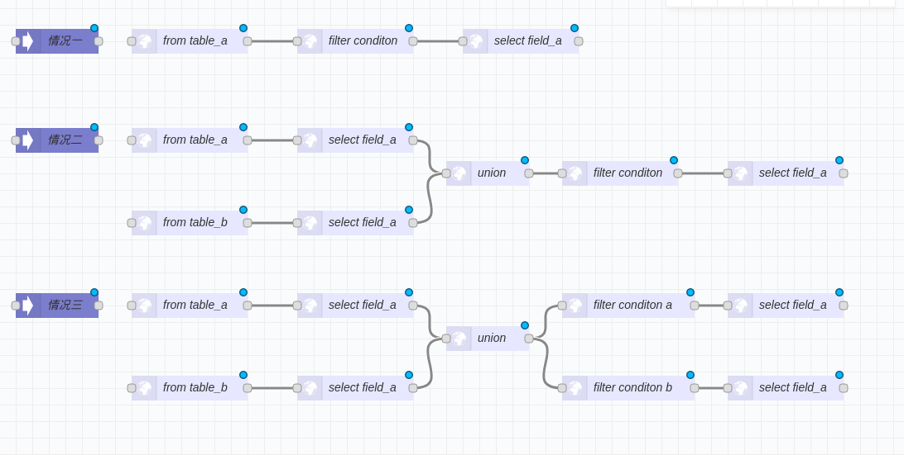

# 图逻辑 执行引擎
## 什么是图逻辑?
这个是我自己创造的概念. 主要是没有准确的概念来描述. 相似的概念有,计算流,数据流,流,图结构数据流.
总之, 都很形象但又不准确. 比如流计算,显然是另一回事.
我这里"图逻辑", 类似tensorflow的计算图. 或者nodered里的flow. 或者代码解析器解析后的AST.
总之,它有两个核心特点. 
1. 它蕴含逻辑(包括计算及数据)
2. 它是图结构的数据(也就是点和边),对应的是逻辑单元及逻辑依赖.

### 一个示例
```
select field_a from table_b where condition=c
```
这是一个简单的查询逻辑,从表里根据条件筛选某个字段的数据.

转成逻辑流可以是这样的:
A(from table_b)  -> B(filter  condition c) -> C(select field_a)
这里有A,B,C三个逻辑单元. 然后有A->B ,B->C两个逻辑依赖.

转成JSON的图数据结构是:
```
{
    nodes:[
        {id:'A',
           type: 'from',
           params:['table_b'],
        },
        {
            id:'B',
            type: 'filter',
            params:['condition' ,'c'],
        },
        {
            id:'C',
            type:'select',
            params: ['field_a'],
        }
    ]
    edges:[
        {from:'A',to:'B'},
        {from:'B',to:'C'},
    ]
}
```
这是一种形式.
还有一种形式是:
```
[
    {id:'A',
           type: 'from',
           params:['table_b'],
           linkto:['B'],
        },
        {
            id:'B',
            type: 'filter',
            params:['condition' ,'c'],
            linkto:['C'],
        },
        {
            id:'C',
            type:'select',
            params: ['field_a'],
            linkto: [],
        }
]
```
以上两种形式的JSON都与`select field_a from table_b where condition=c`等价.

现在我们再来展示一种查询:
`select filed_a from (select field_a from table_b  union select field_a from table_c) where condition d`

这个就有点复杂了:
转成逻辑流是这样的


    B(from table_b) -> A(select field_a)---
                                                            ---> E(union A C） ---->>>
    D(from table_c) -> C(select field_a)---

    ->>>->F(from  E)  ->  G(filter  conditon d ) -> H(select field_a)

逻辑流这里可能看起来不是很直观. 有图片最好了. 但总之就是,一个逻辑单元出现了两个依赖(union部分).
用JSON表达出来,
```
[
    {id:'A',
           type: 'select',
           params:['field_a'],
           linkto:[E],
        },
    {id:'B',
           type: 'from',
           params:['table_b'],
           linkto:['A'],
        },
        {id:'C',
           type: 'select',
           params:['field_a'],
           linkto:[E],
        },
      {id:'D',
           type: 'from',
           params:['table_c'],
           linkto:['C'],
        },
    {id:'E',
           type: 'union',
           params:['A','C'],
           linkto:[F],
        },
         {id:'F',
           type: 'from',
           params:['E'],
           linkto:['G'],
        },
    {
        id:'G',
        type:'filter',
        params:['condition','d'],
        linkto:['H'],
    }
      {
        id:'H',
        type:'select',
        params:['field_a'],
        linkto:[],
    }
]

```
这是第二种情况.
第三种情况比第二种要复杂一点.
我还是贴张图来标明三种情况.


看完图其实可以知道,情况一和情况二只是情况三的退化形式.也就是特例.
所以,我们真正要处理的是情况三这种形式.

## X5执行引擎的设计
输入: 类似情况三这种形式的JSON格式的数据.
输出: 按逻辑单元及逻辑依赖依次执行后的结果.
这个是我们执行引擎要做的事情. 就是拿一个图结构的逻辑块去执行,然后返回执行后的结果.
其本质是个虚拟机.X5是小五.

### 设计内容
核心主体:
1. 指令
2. 状态机调度
3. Hook机制辅助,实现lazy,cache,及数据转换后处理等特性.

#### 指令
针对某种具体的type,比如'select','filter'.都需要有一个对应的指令.
可以理解为一个函数,它负责从params里拿到参数,然后执行具体的逻辑,并且保存结果.
举了例子:
```
X5Engine.registCode('add',function(x,y)=>{return x+y})
```
这个就注册了一条`add`指令. 

#### 状态机调度
我这里的设计不是基于栈的push,pop来执行计算.
而是采用并行的计算单元.各个单元的逻辑都是一致的.
有个基本的触发条件,满足条件执行相关指令调用,执行后将结果传递到被依赖的计算单元就可以了.
就跟击鼓传花一样.
鼓声响起后,每个计算单元只需要判断,花是否在自己手上,如果在,就传个下一个人.
引擎的执行过程,由"花"来推进.
这里需要注意的是环的判断,因为如果有环的存在,鼓声不会停,花会一直传递下去.

#### Hook机制辅助
Hook是观察者模式,或者监听器的一个体现.主要是用来定制化响应,以及解耦.
在一些特定的关口,会丢出一个事件,而Hook可以针对这些事件来处理. Hook队列里的监听器会按权重排序.
从而保证有序处理.
##### hook实现 lazy eval
lazy eval是在指令执行时不执行真正的操作,而是返回一个thunk,这个thunk,也就是个匿名函数,会包含调用的参数及逻辑.
当到达某种触发条件时,比如执行引擎要结束了,此时不得不实例化数据.那么会有一个对应的hook，拿到之前的那个thunk去执行.然后将结果保存.
##### hook实现 cache eval
其原理与lazy无本质区别. 只是一个普通的hook而已,它的处理逻辑是,先从缓存里找,能找到就返回,不能找到就执行并且设置缓存.
##### hook实现数据后处理
它也只是一个普通的hook而已, 它拿到结果收集器里的结果,针对前端需要的数据结构形式做数据格式转换.


### 优化点
1. 并行化执行引擎
    设计的执行状态机是并行的,但是目前效率而言,不如单线程的快. 但长久考虑. 并行的提升空间很大.
2. 按需启动
    目前是一次性所有的并行执行单元都就位后开始执行,实际上可以按需启动.
    道理和击鼓传花的时候,如果花离你很远,那你完全没有必要盯着它一样.
